# Web Load Testing & Performance Analysis Suite

A comprehensive toolkit that combines Gatling load testing with Lighthouse performance analysis to provide deep insights into web application performance.

## 📚 Table of Contents
- [Quick Start](#-quick-start)
- [System Overview](#-system-overview)
- [Detailed Workflows](#-detailed-workflows)
- [Understanding Reports](#-understanding-reports)
- [Common Scenarios & Examples](#-common-scenarios--examples)
- [Troubleshooting](#-troubleshooting)

## 🚀 Quick Start

### Prerequisites
- Java 11+
- Node.js 18+
- sbt 1.9+

### One-Shot Command (Run Everything)
```bash
# Clean previous runs
rm -rf target/gatling/* reports/run-* reports/gatling-json/* playwright/lighthouse-reports/*

# Run load test (2500 users, 5 minutes) + Lighthouse
COMBINED_USERS=2500 COMBINED_DURATION_SECS=300 ./scripts/run_combined.sh && \
./scripts/collect_json.sh && \
(cd playwright && npm i --silent && npm run lh:run && npm run lh:aggregate) && \
open "$(ls -1dt target/gatling/combinedurlssimulation-*/ | head -1)/index.html" "playwright/lighthouse-reports/index.html"
```

## 🔄 System Overview

### Architecture Flow


The system combines two powerful tools:
1. **Gatling**: Load testing engine that simulates user traffic
2. **Lighthouse**: Performance analysis tool that measures page quality

### Data Flow


### Repository Structure


```
web-loadtest/
├── scripts/           # Helper scripts
│   ├── run_combined.sh    # Run all URLs with random distribution
│   ├── run_individual.sh  # Run specific URLs with controlled load
│   └── collect_json.sh    # Gather test results
├── src/              # Gatling test code (Scala)
│   └── test/scala/pharmeasy/
│       ├── CommonConfig.scala           # URL configs & env readers
│       ├── CombinedUrlsSimulation.scala # Random URL distribution
│       └── IndividualUrlsSimulation.scala # Per-URL control
├── playwright/       # Lighthouse & browser tests
│   ├── lighthouse-run.mjs      # Run Lighthouse checks
│   ├── lighthouse-aggregate.mjs # Create summary dashboard
│   └── urls.json              # URLs to test
└── reports/          # Test results
    ├── gatling-json/  # Latest Gatling stats
    └── run-*/         # Time-stamped results
```

## 📊 Understanding Reports

### Gatling Load Test Metrics

```
Global Information
├── Request Count: Total requests made (e.g., 2500)
├── Response Times
│   ├── Min: Fastest response (e.g., 110ms)
│   ├── Max: Slowest response (e.g., 10482ms)
│   ├── Mean: Average (e.g., 444ms)
│   └── Percentiles
│       ├── 50th: Median response
│       ├── 95th: 95% faster than this
│       └── 99th: Outlier detection
└── Distribution
    ├── t < 800 ms: Fast responses
    ├── 800ms - 1200ms: Acceptable
    ├── > 1200ms: Slow
    └── Failed: Errors
```

### Lighthouse Metrics

```
Core Web Vitals
├── LCP (Largest Contentful Paint)
│   ├── Good: < 2.5s
│   ├── Needs Work: 2.5s - 4s
│   └── Poor: > 4s
├── FID (First Input Delay)
│   ├── Good: < 100ms
│   ├── Needs Work: 100ms - 300ms
│   └── Poor: > 300ms
└── CLS (Cumulative Layout Shift)
    ├── Good: < 0.1
    ├── Needs Work: 0.1 - 0.25
    └── Poor: > 0.25
```

## 🎯 Common Scenarios & Examples

### 1. Basic Load Test
```bash
# 100 users over 2 minutes
COMBINED_USERS=100 COMBINED_DURATION_SECS=120 ./scripts/run_combined.sh
```

### 2. High Load Test
```bash
# 2500 users over 5 minutes
COMBINED_USERS=2500 COMBINED_DURATION_SECS=300 ./scripts/run_combined.sh
```

### 3. Individual Page Testing
```bash
# Different loads per page
HOME_USERS=50 HOME_DURATION_SECS=120 \
BLOG_USERS=20 BLOG_DURATION_SECS=120 \
CART_USERS=10 CART_DURATION_SECS=120 \
./scripts/run_individual.sh
```

## 🔍 Reading Test Results

### Example Analysis

```
Load Test Results (2500 users, 300s):
├── Response Times
│   ├── 91% < 800ms (Good)
│   ├── Mean: 444ms (Good)
│   └── No failures (Excellent)
└── Page Distribution
    ├── Home: 341 requests
    ├── Blog: 323 requests
    ├── Cart: 345 requests
    └── Even distribution ✓

Lighthouse Scores:
├── Performance: 68/100
├── Accessibility: 84/100
├── Best Practices: 75/100
└── Core Vitals
    ├── LCP: 3.1s (Needs work)
    ├── FID: 320ms (Poor)
    └── CLS: 0.1 (Good)
```

### Interpreting Results

1. **Load Handling**
   - Even request distribution
   - Good response times
   - No errors under load

2. **Frontend Performance**
   - LCP needs optimization
   - FID indicates JS bottleneck
   - Good visual stability

3. **Action Items**
   ```
   Priority  Issue                Solution
   HIGH      Poor FID            Reduce JS execution time
   MEDIUM    LCP > 2.5s         Optimize image loading
   LOW       Best Practices 75   Update security headers
   ```

## 🔧 Troubleshooting

### Common Issues

1. **High Response Times**
   ```
   Symptom: Mean > 1s
   Check:
   - Database queries
   - Caching config
   - Server resources
   ```

2. **Poor Lighthouse Scores**
   ```
   Symptom: Performance < 70
   Check:
   - Image optimization
   - JS bundling
   - Render blocking
   ```

3. **Error Rates**
   ```
   Symptom: KO > 0
   Check:
   - Server logs
   - Network issues
   - Resource limits
   ```

## 📈 Best Practices

### Testing Workflow

1. **Start Small**
   ```bash
   # Baseline test
   COMBINED_USERS=100 COMBINED_DURATION_SECS=120 ./scripts/run_combined.sh
   ```

2. **Analyze Results**
   - Check response times
   - Review error rates
   - Note Lighthouse scores

3. **Increase Load**
   ```bash
   # Increment users
   COMBINED_USERS=500 COMBINED_DURATION_SECS=120 ./scripts/run_combined.sh
   ```
   Run the execution and open the report combine in 1 go: 

   COMBINED_USERS=6500 COMBINED_DURATION_SECS=300 ./scripts/run_combined.sh && ./scripts/collect_json.sh && (cd playwright && npm i --silent && npm run lh:run --silent && npm run lh:aggregate --silent) && open "$(ls -1dt /Users/gauravsingh/Documents/web-loadtest/target/gatling/combinedurlssimulation-*/ | head -1)/index.html" "/Users/gauravsingh/Documents/web-loadtest/playwright/lighthouse-reports/index.html"

4. **Monitor & Adjust**
   - Watch for degradation
   - Identify bottlenecks
   - Optimize as needed

### Optimization Cycle

```
1. Baseline → 2. Test → 3. Analyze → 4. Optimize → 5. Verify
   ↑                                                    |
   └────────────────────────────────────────────────────┘
```

## 🤝 Contributing

1. Fork the repository
2. Create a feature branch
3. Make your changes
4. Submit a pull request

## 📚 Resources

- [Gatling Docs](https://gatling.io/docs/current/)
- [Lighthouse Docs](https://developers.google.com/web/tools/lighthouse)
- [Web Performance](https://web.dev/performance-scoring/)
