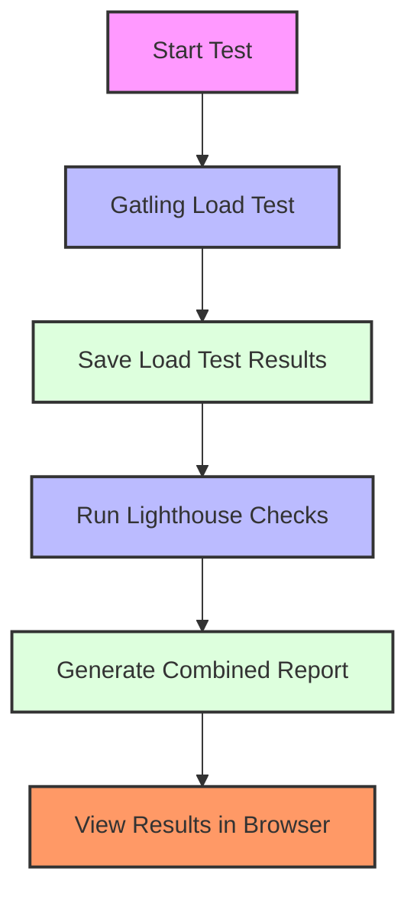
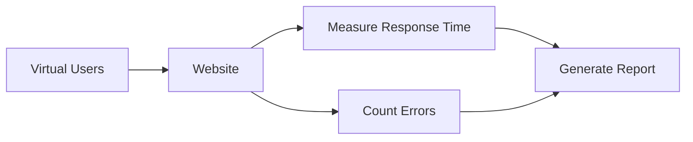
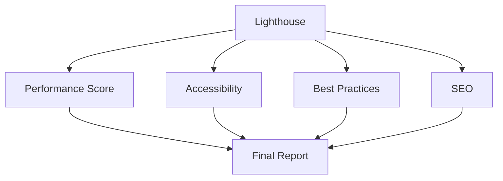

# Web Load Testing & Performance Analysis Guide

## 🎯 What This Project Does

This project helps test and measure how well a website performs under different conditions. Think of it like a health check-up for websites! We use two main tools:

1. **Gatling** - Like a crowd simulator that pretends to be many users visiting the website at once
2. **Lighthouse** - Like a website doctor that checks how healthy and fast the pages are

## 🗺️ Project Overview

```
web-loadtest/
├── scripts/           # Helper scripts to run tests
├── src/              # Gatling test code (written in Scala)
├── playwright/       # Lighthouse and browser tests
├── reports/          # Where test results are saved
└── docs/            # Documentation and diagrams
```

## 🔄 How It All Works Together



## 🚀 Getting Started

### Prerequisites
- Java 11 or newer (for Gatling)
- Node.js 18 or newer (for Lighthouse)
- sbt (for running Scala code)

### Step-by-Step Setup

1. **Clone the Repository**
   ```bash
   git clone <repository-url>
   cd web-loadtest
   ```

2. **Install Node.js Dependencies**
   ```bash
   cd playwright
   npm install
   npm run install-browsers
   cd ..
   ```

## 📊 Running Tests

### Simple One-Shot Test
Run everything with one command:
```bash
COMBINED_USERS=100 COMBINED_DURATION_SECS=120 ./scripts/run_combined.sh && ./scripts/collect_json.sh && (cd playwright && npm i --silent && npm run lh:run && npm run lh:aggregate) && open "$(ls -1dt target/gatling/combinedurlssimulation-*/ | head -1)/index.html" "playwright/lighthouse-reports/index.html"
```

This command:
1. Runs load test with 100 users for 120 seconds
2. Collects test results
3. Runs website health checks
4. Opens reports in your browser

### Understanding the Parts

#### 🏃‍♂️ Gatling Load Test
- **What it does**: Creates virtual users that visit your website
- **How it works**: 
  - Each virtual user follows a script
  - They visit different pages randomly
  - Gatling measures how fast each page loads
  - It tracks if any errors happen



#### 🔍 Lighthouse Checks
- **What it does**: Detailed analysis of each page
- **Measures**:
  - How fast the page loads
  - How well it works on mobile
  - Accessibility features
  - Best practices
  - SEO friendliness



## 📁 Understanding the Folders

### `scripts/` Directory
- `run_combined.sh`: Runs load test with all users hitting random pages
- `run_individual.sh`: Runs load test with control over each page
- `collect_json.sh`: Gathers all test results

### `src/` Directory
Contains Gatling test code:
- `CommonConfig.scala`: Settings like which URLs to test
- `CombinedUrlsSimulation.scala`: Code for random page visits
- `IndividualUrlsSimulation.scala`: Code for controlled page visits

### `playwright/` Directory
Contains Lighthouse and browser test code:
- `lighthouse-run.mjs`: Runs page health checks
- `lighthouse-aggregate.mjs`: Combines all results
- `urls.json`: List of pages to check

### `reports/` Directory
Where all results are saved:
- `gatling/`: Load test results
- `lighthouse/`: Page health check results

## 📈 Reading the Reports

### Gatling Report Shows:
- How many users visited
- How fast pages loaded
- Any errors that happened
- Graphs showing performance over time

### Lighthouse Report Shows:
- Performance scores for each page
- Suggestions for improvements
- Detailed metrics about page load
- SEO and accessibility scores

## 🔧 Customizing Tests

### Change Number of Users
```bash
COMBINED_USERS=500 COMBINED_DURATION_SECS=300 ./scripts/run_combined.sh
```

### Test Specific Pages
```bash
HOME_USERS=50 HOME_DURATION_SECS=120 \
BLOG_USERS=30 BLOG_DURATION_SECS=120 \
./scripts/run_individual.sh
```

## 🎓 Learning More

### Key Terms
- **Response Time**: How long a page takes to load
- **Throughput**: How many users can visit at once
- **Error Rate**: Percentage of failed page loads
- **Performance Score**: Overall health grade for a page

### Recommended Flow
1. Start with small tests (100 users)
2. Check reports for problems
3. Fix issues found
4. Run bigger tests
5. Compare results

## 🤝 Contributing
Want to help improve the tests?
1. Fork the repository
2. Create a new branch
3. Make your changes
4. Submit a pull request

## 📚 Resources
- [Gatling Documentation](https://gatling.io/docs/current/)
- [Lighthouse Documentation](https://developers.google.com/web/tools/lighthouse)
- [Performance Testing Basics](https://web.dev/performance-scoring/)
