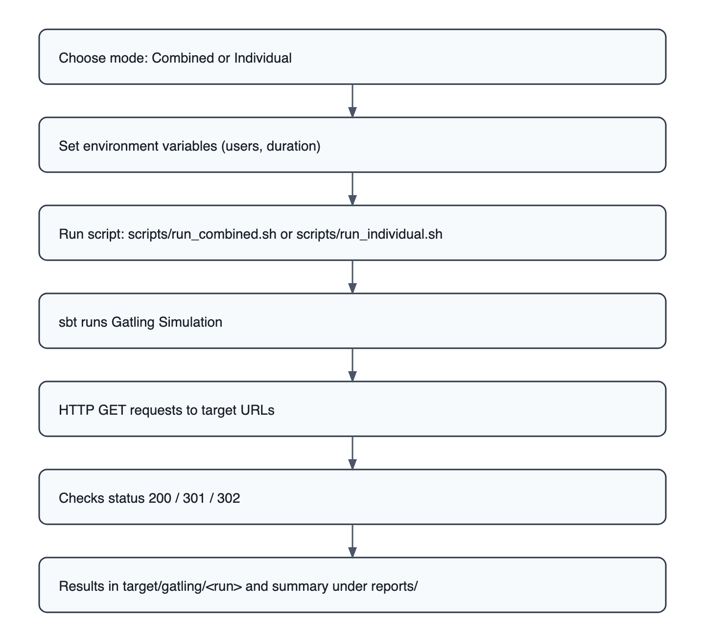
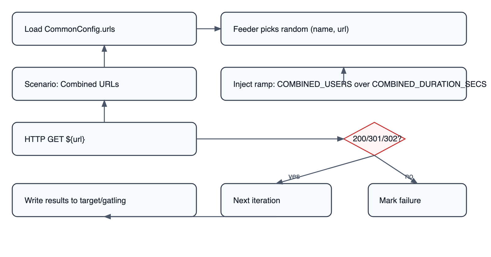
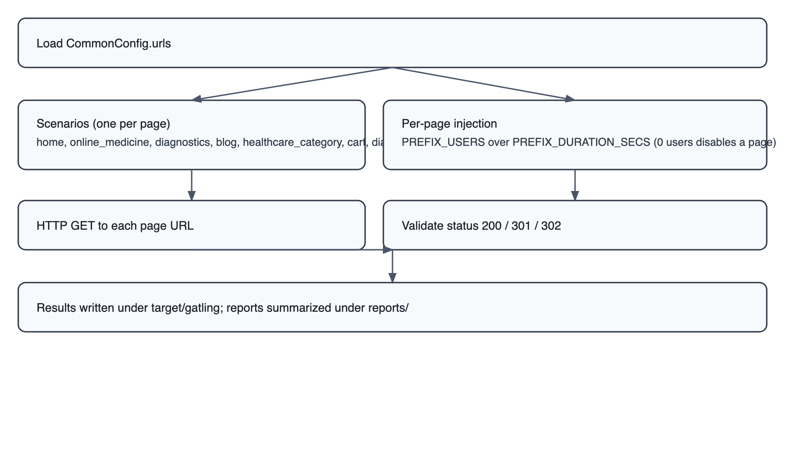

## PharmEasy Web Load Test – Technical Overview

This repository contains a lightweight web load and quality toolkit built around Gatling (Scala) for load generation and Playwright + Lighthouse (Node.js) for optional smoke and performance audits.


### What you get
- **Gatling load tests**: two modes
  - **Combined URLs**: one scenario randomly hits any configured page.
  - **Individual URLs**: one scenario per page; you control load per page via env vars (can be used as “single-page” by setting all other pages to 0 users).
- **Reports**: HTML results under `reports/` and `target/gatling/`.
- **Optional QA utilities**: Playwright smoke navigation and Lighthouse reports with an aggregate dashboard.


## Tech Stack
- **Gatling 3.10.x** (Scala 2.13) for HTTP load testing
- **sbt** build with `GatlingPlugin`
- **Playwright** (optional) for smoke checks
- **Lighthouse** (optional) for web performance audits


## Repository layout
```
build.sbt
conf/gatling.conf                    # Gatling config (defaults; override via -D or env)
scripts/
  run_individual.sh                  # Runs IndividualUrlsSimulation
  run_combined.sh                    # Runs CombinedUrlsSimulation
  collect_json.sh                    # Copies latest Gatling JSONs to reports/gatling-json
src/test/scala/pharmeasy/
  CommonConfig.scala                 # URL map + env readers
  IndividualUrlsSimulation.scala     # Per-page scenarios (env-tunable; supports single-page)
  CombinedUrlsSimulation.scala       # Randomized single scenario across all URLs
reports/                             # Consolidated HTML reports per run
target/gatling/                      # Raw Gatling outputs (one folder per run)
playwright/                          # Optional UI smoke + Lighthouse
  tests/smoke.spec.ts
  urls.json                          # Pages used by Playwright/Lighthouse
  lighthouse-run.mjs
  lighthouse-aggregate.mjs
  playwright.config.ts
```


## Configuration and scenarios

### URLs and environment
`src/test/scala/pharmeasy/CommonConfig.scala` centralizes page targets and helpers to read env vars.

```12:21:src/test/scala/pharmeasy/CommonConfig.scala
  val urls: Map[String, String] = Map(
    "home" -> "https://pharmeasy.in/",
    "online_medicine" -> "https://pharmeasy.in/online-medicine-order?src=homecard",
    "diagnostics" -> "https://pharmeasy.in/diagnostics",
    "blog" -> "https://pharmeasy.in/blog/",
    "healthcare_category" -> "https://pharmeasy.in/health-care/9066?src=homecard",
    "cart" -> "https://pharmeasy.in/cart?src=header",
    "diag_cart" -> "https://pharmeasy.in/diag-pwa/cart"
  )
```

Use env vars to control ramp users and duration:
- Combined mode: `COMBINED_USERS`, `COMBINED_DURATION_SECS`
- Individual mode: `<PREFIX>_USERS`, `<PREFIX>_DURATION_SECS` per page, where prefixes are `HOME`, `MEDICINE`, `DIAG`, `BLOG`, `HCAT`, `CART`, `DCART`.


### Individual URLs flow
Creates one scenario per configured page. You can “single-page” run by setting every other page’s users to 0.

```1:18:src/test/scala/pharmeasy/IndividualUrlsSimulation.scala
class IndividualUrlsSimulation extends Simulation {
  private def buildScenario(name: String, url: String, envPrefix: String) = {
    val rampUsersCount = CommonConfig.rampUsersFromEnv(s"${envPrefix}_USERS", 10)
    val durationSecs   = CommonConfig.durationFromEnvSeconds(s"${envPrefix}_DURATION_SECS", 60)
    val scn = scenario(s"GET ${name}")
      .exec(http(s"GET ${name}").get(url).check(status.in(200, 301, 302)))
    scn.inject(rampUsers(rampUsersCount).during(durationSecs.seconds))
  }
```


### Combined URLs flow
One scenario; each user picks a random URL from the map via a feeder.

```15:33:src/test/scala/pharmeasy/CombinedUrlsSimulation.scala
  private val urlsSeq = CommonConfig.urls.toSeq
  private val feeder = Iterator.continually(Map("_urlPair" -> urlsSeq(scala.util.Random.nextInt(urlsSeq.length))))
  private val totalUsers = CommonConfig.rampUsersFromEnv("COMBINED_USERS", 50)
  private val durationSecs = CommonConfig.durationFromEnvSeconds("COMBINED_DURATION_SECS", 120)
  private val scn = scenario("Combined URLs Random GET")
    .feed(feeder)
    .exec { session =>
      val (name, url) = session("_urlPair").as[(String, String)]
      session.set("urlName", name).set("url", url)
    }
    .exec(http("GET - ${urlName}").get("${url}").check(status.in(200, 301, 302)))
```


## High-level flow (Gatling)




## Detailed flows

### Combined URLs



### Individual URLs (single-page supported)




## How to run

### Prerequisites
- Java 11+
- sbt 1.9+
- Node.js 18+ (only for Playwright/Lighthouse optional steps)


### Clone
```bash
git clone https://github.com/your-org/web-loadtest.git
cd web-loadtest
```


### Run – Combined URLs
Runs one scenario that randomly hits all configured pages.
```bash
COMBINED_USERS=100 COMBINED_DURATION_SECS=120 ./scripts/run_combined.sh
```
Outputs:
- Raw Gatling: `target/gatling/combinedurlssimulation-<timestamp>/`
- Consolidated: `reports/run-<timestamp>/index.html`


### Run – Individual URLs (per-page; supports single-page)
Runs one scenario per page. Control each page’s load independently via env vars.

Run all with different loads:
```bash
HOME_USERS=20 HOME_DURATION_SECS=60 \
MEDICINE_USERS=10 MEDICINE_DURATION_SECS=60 \
DIAG_USERS=10 DIAG_DURATION_SECS=60 \
BLOG_USERS=5 BLOG_DURATION_SECS=60 \
HCAT_USERS=5 HCAT_DURATION_SECS=60 \
CART_USERS=5 CART_DURATION_SECS=60 \
DCART_USERS=5 DCART_DURATION_SECS=60 \
./scripts/run_individual.sh
```

Run a single page only (example: home): set all others to 0 users.
```bash
HOME_USERS=50 HOME_DURATION_SECS=120 \
MEDICINE_USERS=0 DIAG_USERS=0 BLOG_USERS=0 HCAT_USERS=0 CART_USERS=0 DCART_USERS=0 \
./scripts/run_individual.sh
```
Note: `rampUsers(0)` skips injection for that page.


### Export latest Gatling JSONs
```bash
./scripts/collect_json.sh
# Copies to reports/gatling-json/ (including js/stats.json if present)
```


## Optional: Playwright smoke + Lighthouse

### Playwright smoke
```bash
cd playwright
npm i
npm run install-browsers
npm test
```
Config: `playwright/playwright.config.ts`; URLs: `playwright/tests/smoke.spec.ts`.

### Lighthouse reports + dashboard
```bash
cd playwright
npm i
npm run lh:run          # generates one HTML and one JSON per page into ./lighthouse-reports
npm run lh:aggregate    # creates ./lighthouse-reports/index.html summary
npm run lh:serve        # optional static server on http://localhost:5600
```
Targets are read from `playwright/urls.json`.

To include Gatling page load metrics in the dashboard, first collect the latest Gatling stats:
```bash
./scripts/collect_json.sh   # copies js/stats.json to reports/gatling-json/stats.json
cd playwright && npm run lh:aggregate
```

### One-shot: Gatling + Lighthouse together (macOS)
Run combined Gatling load, collect Gatling stats, generate Lighthouse reports and the summary dashboard, and open both reports in one command:

```bash
COMBINED_USERS=2500 COMBINED_DURATION_SECS=120 ./scripts/run_combined.sh && ./scripts/collect_json.sh && (cd playwright && npm i --silent && npm run lh:run && npm run lh:aggregate) && open "$(ls -1dt reports/run-*/ | head -1)/index.html" "playwright/lighthouse-reports/index.html"
```

- **Runs Gatling combined scenario**: generates `reports/run-<timestamp>/index.html`.
- **Collects latest Gatling JSON**: saves `reports/gatling-json/stats.json`.
- **Runs Lighthouse** for pages in `playwright/urls.json` and **aggregates** `playwright/lighthouse-reports/index.html` (includes Gatling mean response times if available).
- **Opens** the latest Gatling report and the Lighthouse dashboard.


Longer run example (300s duration):

```bash
COMBINED_USERS=100 COMBINED_DURATION_SECS=300 ./scripts/run_combined.sh && ./scripts/collect_json.sh && (cd playwright && npm i --silent && npm run lh:run && npm run lh:aggregate) && open "$(ls -1dt reports/run-*/ | head -1)/index.html" "playwright/lighthouse-reports/index.html"
```


## Notes and troubleshooting
- If `sbt` isn’t found, install sbt and ensure it’s on PATH.
- If Java is missing or version < 11, install a compatible JDK.
- Proxy-restricted environments may require JVM/system proxy settings: `JAVA_TOOL_OPTIONS` or `-Dhttp.proxyHost` / `-Dhttps.proxyHost`.
- Public, unauthenticated pages only are targeted by default.


## Appendix: Build
`build.sbt` pins Gatling libraries and enables the Gatling plugin. You may pass JVM/system properties to tweak Gatling (`conf/gatling.conf`) via the `sbt` command in scripts if needed.


