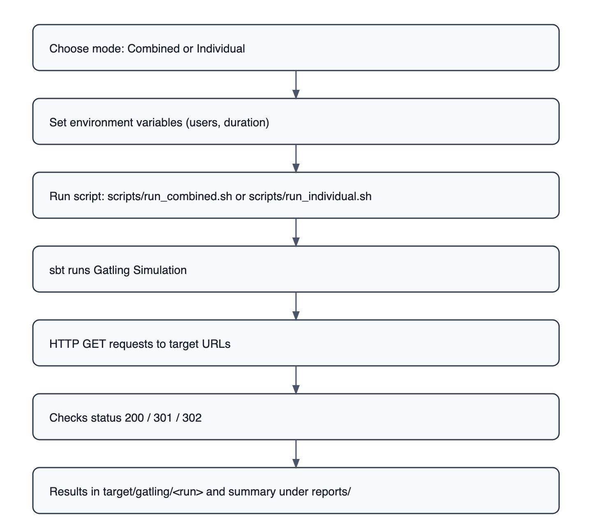
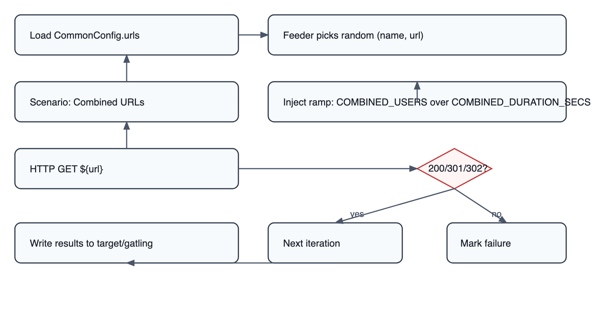
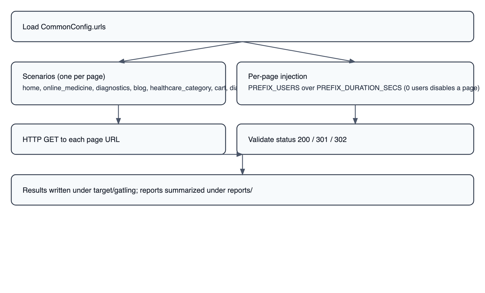

## PharmEasy Web Load Test – Technical Overview

This repository contains a lightweight web load and quality toolkit built around Gatling (Scala) for load generation and Playwright + Lighthouse (Node.js) for optional smoke and performance audits.


### What you get
- **Gatling load tests**: two modes
  - **Combined URLs**: one scenario randomly hits any configured page.
  - **Individual URLs**: one scenario per page; you control load per page via env vars (can be used as “single-page” by setting all other pages to 0 users).
- **Reports**: HTML results under `reports/` and `target/gatling/`.
- **Optional QA utilities**: Playwright smoke navigation and Lighthouse reports with an aggregate dashboard.


## Tech Stack
- **Gatling 3.10.x** (Scala 2.13) for HTTP load testing
- **sbt** build with `GatlingPlugin`
- **Playwright** (optional) for smoke checks
- **Lighthouse** (optional) for web performance audits


## Repository layout
```
build.sbt
conf/gatling.conf                    # Gatling config (defaults; override via -D or env)
scripts/
  run_individual.sh                  # Runs IndividualUrlsSimulation
  run_combined.sh                    # Runs CombinedUrlsSimulation
  collect_json.sh                    # Copies latest Gatling JSONs to reports/gatling-json
src/test/scala/pharmeasy/
  CommonConfig.scala                 # URL map + env readers
  IndividualUrlsSimulation.scala     # Per-page scenarios (env-tunable; supports single-page)
  CombinedUrlsSimulation.scala       # Randomized single scenario across all URLs
reports/                             # Consolidated HTML reports per run
target/gatling/                      # Raw Gatling outputs (one folder per run)
playwright/                          # Optional UI smoke + Lighthouse
  tests/smoke.spec.ts
  urls.json                          # Pages used by Playwright/Lighthouse
  lighthouse-run.mjs
  lighthouse-aggregate.mjs
  playwright.config.ts
```


## Configuration and scenarios

### URLs and environment
`src/test/scala/pharmeasy/CommonConfig.scala` centralizes page targets and helpers to read env vars.

```12:21:src/test/scala/pharmeasy/CommonConfig.scala
  val urls: Map[String, String] = Map(
    "home" -> "https://pharmeasy.in/",
    "online_medicine" -> "https://pharmeasy.in/online-medicine-order?src=homecard",
    "diagnostics" -> "https://pharmeasy.in/diagnostics",
    "blog" -> "https://pharmeasy.in/blog/",
    "healthcare_category" -> "https://pharmeasy.in/health-care/9066?src=homecard",
    "cart" -> "https://pharmeasy.in/cart?src=header",
    "diag_cart" -> "https://pharmeasy.in/diag-pwa/cart"
  )
```

Use env vars to control ramp users and duration:
- Combined mode: `COMBINED_USERS`, `COMBINED_DURATION_SECS`
- Individual mode: `<PREFIX>_USERS`, `<PREFIX>_DURATION_SECS` per page, where prefixes are `HOME`, `MEDICINE`, `DIAG`, `BLOG`, `HCAT`, `CART`, `DCART`.

Optional **cookies** (standard HTTP `Cookie` header on Gatling, Lighthouse, and Playwright).

**Default (no env):** if none of the env vars below are set, all tools read the **first non-comment line** of **`config/pharmeasy-default-cookie.txt`** (under the repo root). Edit that file to change the default for every URL in load tests / Lighthouse / Playwright.

**Opt out:** `export DISABLE_PHARMEASY_COOKIE=1` (or `true`) sends **no** `Cookie` header.

**Overrides** (highest priority first when not disabled):

1. **`PHARMEASY_COOKIE`** — full cookie string (matches curl `--header 'Cookie: …'` body only), e.g.  
   `X-Access-Token=…; XdI=…`
2. Or **`X_ACCESS_TOKEN`** and **`XDI`** — combined as `X-Access-Token=<X_ACCESS_TOKEN>; XdI=<XDI>` (if `XDI` is omitted, only `X-Access-Token=…` is sent).
3. Legacy: **`ACCESS_TOKEN`** only → `accessToken=<value>`.

Treat tokens as secrets in shared repos; prefer CI-injected `PHARMEASY_COOKIE` over committing live values in `config/pharmeasy-default-cookie.txt`.

Examples (curl-style):
```bash
export PHARMEASY_COOKIE='X-Access-Token=7qZ0ifsxDwDJBAFqp1_iNMA2oq_0RP-H; XdI=ffy13v6U5pQqAM4qRj5xn'
COMBINED_USERS=100 COMBINED_DURATION_SECS=120 ./scripts/run_combined.sh
```
```bash
export X_ACCESS_TOKEN='7qZ0ifsxDwDJBAFqp1_iNMA2oq_0RP-H'
export XDI='ffy13v6U5pQqAM4qRj5xn'
COMBINED_USERS=100 COMBINED_DURATION_SECS=120 ./scripts/run_combined.sh
```
For a **noisier Gatling dry run** (more HTTP logs), append a logback override (optionally combine with your usual `-Xmx` flags):
```bash
export GATLING_JAVA_OPTS="-Dlogback.configurationFile=classpath:logback-dryrun.xml"
```

**Per-request line logging** (each virtual user’s GET, URL, optional `Cookie` string): enable with **any** of the following, disable by unsetting or setting to `false`:

- `export GATLING_DEBUG=true` (recommended), or `export DEBUG=true`
- JVM: add **`-Dgatling.request.debug=true`** to `GATLING_JAVA_OPTS` (or pass via `sbt`)

Logger name: `pharmeasy.request`. Example:

```bash
export GATLING_DEBUG=true
COMBINED_USERS=5 COMBINED_DURATION_SECS=10 ./scripts/run_combined.sh
```

At very high user counts, turn this **off** to avoid log I/O slowing the generator.


### Individual URLs flow
Creates one scenario per configured page. You can “single-page” run by setting every other page’s users to 0.

```18:31:src/test/scala/pharmeasy/IndividualUrlsSimulation.scala
  private def buildScenario(name: String, url: String, envPrefix: String) = {
    val rampUsersCount = CommonConfig.rampUsersFromEnv(s"${envPrefix}_USERS", 10)
    val durationSecs   = CommonConfig.durationFromEnvSeconds(s"${envPrefix}_DURATION_SECS", 60)

    val scn = scenario(s"GET ${name}")
      .exec(RequestDebug.logOutgoingIndividual(name, url))
      .exec(
        http(s"GET ${name}")
          .get(url)
          .check(status.in(200, 301, 302))
      )

    scn.inject(
      rampUsers(rampUsersCount).during(durationSecs.seconds)
    )
  }
```


### Combined URLs flow
One scenario; each user picks a random URL from the map via a feeder.

```15:33:src/test/scala/pharmeasy/CombinedUrlsSimulation.scala
  private val urlsSeq = CommonConfig.urls.toSeq
  private val feeder = Iterator.continually(Map("_urlPair" -> urlsSeq(scala.util.Random.nextInt(urlsSeq.length))))
  private val totalUsers = CommonConfig.rampUsersFromEnv("COMBINED_USERS", 50)
  private val durationSecs = CommonConfig.durationFromEnvSeconds("COMBINED_DURATION_SECS", 120)
  private val scn = scenario("Combined URLs Random GET")
    .feed(feeder)
    .exec { session =>
      val (name, url) = session("_urlPair").as[(String, String)]
      session.set("urlName", name).set("url", url)
    }
    .exec(http("GET - ${urlName}").get("${url}").check(status.in(200, 301, 302)))
```


## High-level flow (Gatling)




## Detailed flows

### Combined URLs



### Individual URLs (single-page supported)




## How to run

### Prerequisites
- Java 11+
- sbt 1.9+
- Node.js 18+ (only for Playwright/Lighthouse optional steps)


### Clone
```bash
git clone https://github.com/your-org/web-loadtest.git
cd web-loadtest
```


### Run – Combined URLs
Runs one scenario that randomly hits all configured pages.
```bash
COMBINED_USERS=100 COMBINED_DURATION_SECS=120 ./scripts/run_combined.sh
```
Outputs:
- Raw Gatling: `target/gatling/combinedurlssimulation-<timestamp>/`
- Consolidated: `reports/run-<timestamp>/index.html`

#### Heavy load (e.g. 2500 users over 300 seconds)
`CombinedUrlsSimulation` uses `rampUsers(COMBINED_USERS).during(COMBINED_DURATION_SECS)` and **one GET per virtual user**. Injection is spread across the whole window, but if responses are slow, **many users can be in flight at once**, which stresses **heap**, **CPU**, and **open sockets** on the machine running Gatling—not only the target site.

**Run it reliably:**

1. **JVM heap for the forked Gatling process** (recommended before large runs):
   ```bash
   export GATLING_JAVA_OPTS="-Xmx8g -Xms512m -XX:+UseG1GC"
   ```
   The Gatling sbt plugin’s fork ships with **`-Xmx1G`**; this project appends **`GATLING_JAVA_OPTS` to `Gatling / javaOptions`** so your **`-Xmx`** overrides that limit (HotSpot uses the last `-Xmx`). If you set **`-Xms`**, keep it **strictly below your effective `-Xmx`** or omit `-Xms`, otherwise the VM fails with *“Initial heap size set to a larger value than the maximum heap size”*.

   Adjust `-Xmx` to a safe fraction of RAM on the load generator; avoid swapping.

2. **Raise file descriptor limit** (common failure under concurrency on macOS/Linux):
   ```bash
   ulimit -n 65535
   ```

3. **Hardware / placement**: Prefer a **dedicated Linux host or cloud VM** (8+ vCPU, plenty of RAM) in the **same region** as the target. Laptops often become the bottleneck (Wi‑Fi, thermal throttling, low default `ulimit`).

4. **Target and policy**: Very high load against **production** can trigger **rate limits, WAF blocks, or IP bans**. Coordinate with the team; use **staging** or **canary** when possible, or **split** load (e.g. two VMs × 1250 users with staggered ramps) only if policy allows.

5. **Beyond one JVM**: To go much higher than a single process comfortably supports, use **multiple load generators** (separate machines each running a slice of users, or Gatling Enterprise / distributed setups). One repo, one `sbt` process is still **one client origin** with finite throughput.

6. **Optional – same command you already use:**
   ```bash
   export GATLING_JAVA_OPTS="-Xmx8g -Xms512m -XX:+UseG1GC"
   ulimit -n 65535
   COMBINED_USERS=2500 COMBINED_DURATION_SECS=300 ./scripts/run_combined.sh
   ```


### Run – Individual URLs (per-page; supports single-page)
Runs one scenario per page. Control each page’s load independently via env vars.

Run all with different loads:
```bash
HOME_USERS=20 HOME_DURATION_SECS=60 \
MEDICINE_USERS=10 MEDICINE_DURATION_SECS=60 \
DIAG_USERS=10 DIAG_DURATION_SECS=60 \
BLOG_USERS=5 BLOG_DURATION_SECS=60 \
HCAT_USERS=5 HCAT_DURATION_SECS=60 \
CART_USERS=5 CART_DURATION_SECS=60 \
DCART_USERS=5 DCART_DURATION_SECS=60 \
./scripts/run_individual.sh
```

Run a single page only (example: home): set all others to 0 users.
```bash
HOME_USERS=50 HOME_DURATION_SECS=120 \
MEDICINE_USERS=0 DIAG_USERS=0 BLOG_USERS=0 HCAT_USERS=0 CART_USERS=0 DCART_USERS=0 \
./scripts/run_individual.sh
```
Note: `rampUsers(0)` skips injection for that page.


### Export latest Gatling JSONs
```bash
./scripts/collect_json.sh
# Copies to reports/gatling-json/ (including js/stats.json if present)
```


## Optional: Playwright smoke + Lighthouse

### Playwright smoke
```bash
cd playwright
npm i
npm run install-browsers
npm test
```
Config: `playwright/playwright.config.ts`; URLs: `playwright/tests/smoke.spec.ts`.

### Lighthouse reports + dashboard
```bash
cd playwright
npm i
npm run lh:run          # generates one HTML and one JSON per page into ./lighthouse-reports
npm run lh:aggregate    # creates ./lighthouse-reports/index.html summary
npm run lh:serve        # optional static server on http://localhost:5600
```
Targets are read from `playwright/urls.json`.

#### Chrome binary (Lighthouse)
`lighthouse-run.mjs` launches Chrome via `chrome-launcher`. The binary is resolved in this order:

1. **`CHROME_PATH`** — if set and the file exists, that executable is used (e.g. Google Chrome or Chromium on disk).
2. **Playwright’s Chromium** — `chromium.executablePath()` is used only when it returns a path that exists (wraps failures so a bad or missing install does not crash the launcher).
3. **Auto-detect** — if neither applies, `chrome-launcher` picks a system Chrome/Chromium install.

Install Playwright browsers when you want the bundled Chromium: `cd playwright && npx playwright install chromium`.

#### Headless vs headed
- **Lighthouse** runs **headless** by default using `--headless=new`. To debug with a visible window: `HEADED=1` or `LIGHTHOUSE_HEADED=1`. To use the older headless flag: `LIGHTHOUSE_HEADLESS_MODE=old` (uses `--headless` instead of `--headless=new`).
- **Playwright tests** default to **headless**. Use `HEADED=1` for a visible browser, or `PWDEBUG=1` for the Playwright inspector (headed).

To include Gatling page load metrics in the dashboard, first collect the latest Gatling stats:
```bash
./scripts/collect_json.sh   # copies js/stats.json to reports/gatling-json/stats.json
cd playwright && npm run lh:aggregate
```

### One-shot: Gatling + collect JSON + Lighthouse + aggregate (macOS)
Optional cleanup of previous Gatling/Lighthouse outputs, then run the full pipeline and open the HTML reports:

```bash
# Optional: reset prior outputs
rm -rf target/gatling/* reports/run-* reports/gatling-json/* playwright/lighthouse-reports/*

COMBINED_USERS=2500 COMBINED_DURATION_SECS=300 ./scripts/run_combined.sh && \
./scripts/collect_json.sh && \
(cd playwright && npm i --silent && npm run lh:run && npm run lh:aggregate) && \
open "$(ls -1dt target/gatling/combinedurlssimulation-*/ | head -1)/index.html" \
  "playwright/lighthouse-reports/index.html"
```

- **Gatling (combined scenario)** writes the HTML report under `target/gatling/combinedurlssimulation-<timestamp>/index.html`.
- **`collect_json.sh`** copies JSON (including `js/stats.json` as `reports/gatling-json/stats.json` when present).
- **`lh:run`** then **`lh:aggregate`** produce per-URL Lighthouse artifacts and `playwright/lighthouse-reports/index.html` (aggregate can fold in Gatling means when stats were collected).
- **`open`** launches the latest Gatling report and the Lighthouse dashboard (macOS). On Linux, open those two paths in a browser manually.

Smaller example:

```bash
COMBINED_USERS=100 COMBINED_DURATION_SECS=120 ./scripts/run_combined.sh && \
./scripts/collect_json.sh && \
(cd playwright && npm i --silent && npm run lh:run && npm run lh:aggregate) && \
open "$(ls -1dt target/gatling/combinedurlssimulation-*/ | head -1)/index.html" \
  "playwright/lighthouse-reports/index.html"
```


## HTTP timeouts (TCP connect & TLS handshake)

Project defaults are in **`conf/gatling.conf`** (`connectTimeout`, `handshakeTimeout`, `http.requestTimeout`, `http.dns.queryTimeout`).

**If you see many `ConnectTimeoutException: connection timed out after 1000` (or other low values):** do **not** set `gatling.socket.connectTimeout` to ~1s under high user counts against a multi‑IP CDN (`pharmeasy.in` resolves to many CloudFront addresses). Thousands of simultaneous new TCP connects will exceed 1s regularly even when the site is healthy. Prefer **10–20s** connect + handshake for heavy ramps, or reduce users / lengthen ramp.

**If you see `SslHandshakeTimeoutException`:** TLS is not finishing in time (overload, cold connections, or too many handshakes in parallel). Mitigations: raise **`gatling.ssl.handshakeTimeout`**, consider enabling **HTTP/2** on the Gatling HTTP protocol (`.enableHttp2()` per Gatling docs) to multiplex on fewer connections, or reduce concurrent new connections.

**500 responses:** origin or edge errors under load—tune traffic with the owning team, use staging, or lower `COMBINED_USERS` / stretch `COMBINED_DURATION_SECS` (gentler ramp).

**`Request timeout … after 60000 ms`:** raise **`gatling.http.requestTimeout`** in `conf/gatling.conf` if pages legitimately exceed 60s, or fix slow pages / cold caches.

Override for one run without editing the file:

```bash
GATLING_JAVA_OPTS="-Dgatling.socket.connectTimeout=20000 -Dgatling.ssl.handshakeTimeout=20000 -Dgatling.http.requestTimeout=120000" \
  COMBINED_USERS=100 COMBINED_DURATION_SECS=120 ./scripts/run_combined.sh
```


## Notes and troubleshooting
- If `sbt` isn’t found, install sbt and ensure it’s on PATH.
- If Java is missing or version < 11, install a compatible JDK.
- **`Initial heap size set to a larger value than the maximum heap size`**: the Gatling fork defaults to **`-Xmx1G`**. If **`GATLING_JAVA_OPTS` only set `-Xms2g`** (or applied on the wrong sbt scope), **initial heap could exceed max heap**. Fix: use **`GATLING_JAVA_OPTS` with a larger `-Xmx` first** (this repo appends to **`Gatling / javaOptions`** so it overrides the 1G cap), and either **omit `-Xms`** or set **`-Xms` lower than `-Xmx`**.
- **Lighthouse / `chrome-launcher`**: if you see errors launching Chrome (for example a `TypeError` around `pid` / `toString`), set **`CHROME_PATH`** to a real Chrome or Chromium binary, or run `npx playwright install chromium` under `playwright/` so the Playwright fallback path exists.
- Lighthouse may log trace warnings such as **`NO_LCP`** on some URLs; reports are still written unless the run aborts.
- Proxy-restricted environments may require JVM/system proxy settings: `JAVA_TOOL_OPTIONS` or `-Dhttp.proxyHost` / `-Dhttps.proxyHost`.
- Public, unauthenticated pages only are targeted by default.


## Appendix: Build
`build.sbt` pins Gatling libraries and enables the Gatling plugin. You may pass JVM/system properties to tweak Gatling (`conf/gatling.conf`) via the `sbt` command in scripts if needed.


